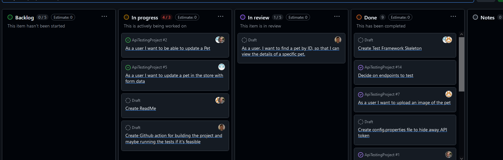
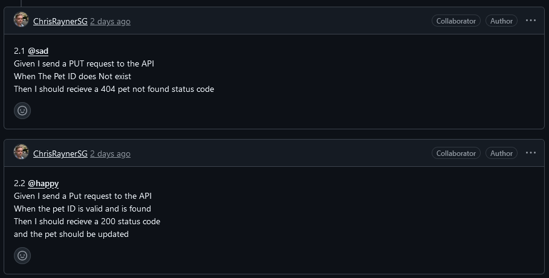

# Pet Store v3.0 Api Testing Project
### Overview
This project aims to test the functionality of the [Petstore3 API](https://petstore3.swagger.io/), using Cucumber and RestAssured to perform comprehensive coverage of the available endpoints of the API.

### Project Management

We used a kanban board for managing this project 

With Acceptance criteria being added to the user stories we created on the board


### Project Setup

1. <b>Clone this repository onto your local system</b>

   2. <b>Set up config.properties</b>
    
       This project comes without a config.properties to avoid sharing sensitive data. This must be set up manually by following the follwoing steps:

       1. Create a resources folder within the test directory
       2. Create a config.properties file containing the following

           ```properties
          baseUri=<DockerContainerLocation>/api/v3
          oAuthKey=<oAuthKey>
           ```
        
           \<DockerContainerLocation> will be covered in the next step

           \<oAuthKey> replace this with your OauthKey for authentication (this is currently not needed)


3. <b>Docker setup</b>
    
    This project uses a docker container as the testing environment, in order to access this, please follow the following steps:
    1. Download and install Docker on your machine from [the docker web-page](https://docs.docker.com/desktop/install/windows-install/) (if not already installed)
    2. Open a terminal/shell and run the following command: 

        ```Docker
        docker pull craynersg/petstore-api-test-project:v1.0
        ```
        
        This will pull the image from Docker Hub

    4. Run the following command to run the container: 

        ```Docker
       docker run -p 8080:8080 craynersg/petstore-api-test-project:v1.0
        ```

    6. In your config.properties set `base_uri=http//localhost:8080`

    Following these steps will set up the container to run on your system, allowing for testing of the Petstore3 API in a dedicated test environment. 
    
    If you wish to stop running the docker container run the following commands from your terminal:

    1.  `docker ps` to find all active containers and the ID of the petstore API container
    2.  `docker stop {container-id-or-name}` the container id can be found from the previous step, you do not have to enter the full ID, the first 3-4 numbers should be sufficient.

    

### Using the Framework 
This Framework uses a Object model structure to abstract the actual Api calls away from where the tests are being written for reusability.
The Actual Test Cases are written in Cucumber with gherkin syntax here is an example

    
```gherkin
@Happy
Scenario Outline: Successful Retrieval of Pet Details
Given I have a valid pet ID of "<petId>"
When I make get a request to find pet by id
Then I should receive a 200 status code
And the pet details should have an ID of "<petId>"
Examples:
| petId |
| 1     |
| 3     |
| 5     |
| 6     |
   ```

This script then points to a step definition which is written in java code 

```java
@When("I make get a request to find pet by id")
public void iMakeGetARequestToFindPetById() {
    model = new FindPetByIdModel(petId);
    model.sendGetRequest();
}
```

Which in turn points to a model which uses rest assured to execute this call 

```java
public void sendGetRequest(){
    response = request.get().prettyPeek().thenReturn();
}
```

When adding tests to this framework be sure your models <b>extend ApiModel</b> and have the import
```java
import static utils.SharedData.*;
```

So that you are able to make use of the shared response and request singleton which allows us to reuse step definitions that check generic things like status code
There is also a RequestUtils class designed to help build rest assured requests.


